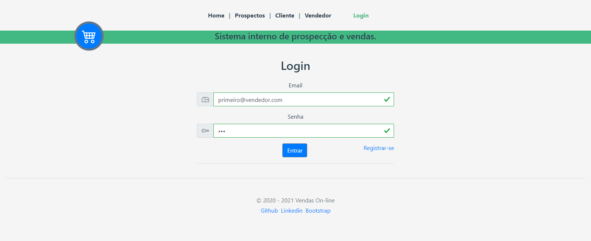
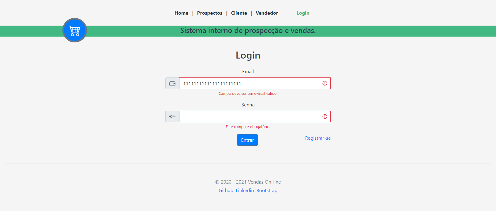
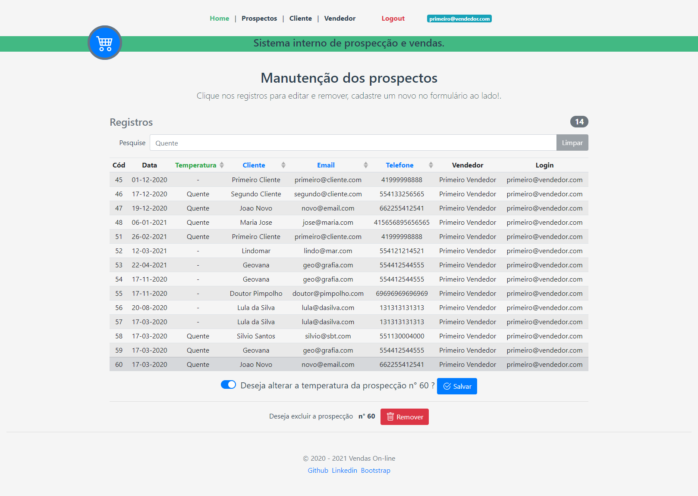
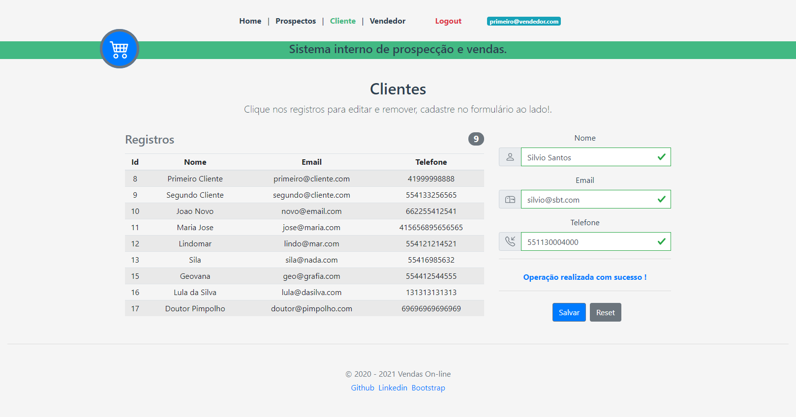

# Sistema operacional para prospecção e vendas

<!--
> Produzido exclusivamente para o processo seletivo da empresa Leads2B.
> 
> Autor: Rodrigo Cirino de Andrade
> 
> Data: Dezembro/2020
-->

## Tecnologias

*entre outros presentes no package.json*

| Tech        | Version           | 
| ------------- |:-------------:| 
|   Nodejs   |   12.17    |
|   MySQL   |   8.0.22    |
|   Vue   |   2.6    |
|   Vue-cli   |   4.5    |
|   Vuex   |   2.6    |
|   VueRouter   |   3.2    |
|   Bootstrap-vue   |   2.17    |
|   Docker   |   20.10    |
|   docker-compose   |   1.27    |


## Instalação

```bash
# Executar o docker-compose presente na raiz do projeto.
$ docker-compose up

# Acessar a url
# http://localhost:8080

# Se aparecer Error Network o banco pode estar sem tabelas, inicie o container mysql_server e rode
# $ docker exec -it mysql_server /bin/sh -c "mysql -uroot -pmysql < docker-entrypoint-initdb.d/dump.sql"
```

## Comentários

Projeto é uma SPA - Single Page Application

Frontend foi feito usando Vuejs + Axios, e layout com Bootstrap atendendo o requisito de responsivo, 
podendo ser aberto no notebook, celular ou tablet.

Backend foi feito usando Nodejs + Express, escolhi Node por já estar trabalhando o front com Vuejs, 
e por ser uma API mais simples sem muitas integrações externas
<!--, mas me sinto confortável em fazer em PHP, Java e Python.-->

<!--
### Conceitos aplicados

Layout responsivo usando o conceito de flexbox do Bootstrap.

Página Home listando as prospecções apenas do vendedor logado.

Lista de prospecções pode ser filtrada digitando "Quente" no campo de busca da página Home.

Simples marcar e desmarcar como quente uma prospecção na página Home.

Layout foi criado por min, com os facilidades existentes no Bootstrap.

Tela de login e registro, com bloqueio por senha de acesso sem autorização.

Aplicado conceitos de Design Patterns e Código limpo.

Uso de promises para as chamadas de banco de dados.

Validação de todos os campos no front com bloqueios antes de enviar ao back.

Desabilitar ações passíveis de problemas por exemplo remover sem selecionar.

Apesar de conhecer bem Gitflow, Code Review, não utilizei nesse projeto.

Apesar de não ser expert em UX fiz o possível para usar icons e cores que combinem. hahaha : )

### Critérios faltantes

Criação de testes automatizados

-->

## Apresentação



---



---



---


---



